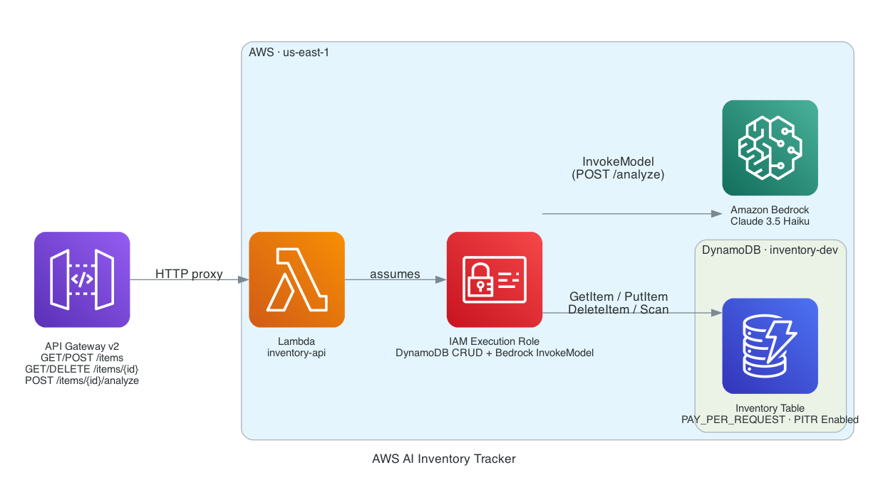

# AWS AI Inventory Tracker

[](https://github.com/jordann6/aws-ai-inventory-tracker/actions/workflows/security-gate.yml)

Terraform-managed AWS infrastructure that provisions a serverless inventory management API backed by DynamoDB, with on-demand AI analysis powered by Amazon Bedrock. Each inventory item can be analyzed in real time — the Lambda calls Claude via Bedrock, evaluates stock levels against the reorder threshold, and returns a structured recommendation with status and suggested reorder quantity.

## Architecture



| Component | Resource | Purpose |
|---|---|---|
| API Gateway v2 | `api-inventory-{env}` | HTTP API with five routes |
| Lambda | `lambda-inventory-api-{env}` | CRUD handlers + Bedrock analysis |
| IAM Execution Role | `role-inventory-lambda-{env}` | Least-privilege access to DynamoDB and Bedrock |
| DynamoDB | `inventory-{env}` | PAY_PER_REQUEST table — versioning + encryption |
| Amazon Bedrock | `claude-3-5-haiku` | Foundation model for stock analysis |

## API Routes

| Method | Path | Description |
|---|---|---|
| `GET` | `/items` | List all inventory items |
| `POST` | `/items` | Create an item |
| `GET` | `/items/{id}` | Get a single item |
| `DELETE` | `/items/{id}` | Delete an item |
| `POST` | `/items/{id}/analyze` | Run Bedrock analysis on an item |

## Features

- **Bedrock analysis** — POST to `/analyze` sends item data to Claude and returns `status`, `recommendation`, and `reorder_quantity`
- **DynamoDB encryption** — AES-256 server-side encryption enabled at rest
- **Point-in-time recovery** — 35-day recovery window on the DynamoDB table
- **Least-privilege IAM** — Lambda role scoped to exact DynamoDB actions and the specific Bedrock model ARN
- **API Gateway v2** — HTTP API with per-route Lambda proxy integration
- **OIDC CI/CD** — GitHub Actions authenticates to AWS via OIDC federated identity, no stored credentials

## Prerequisites

- AWS account with permissions to create IAM roles, DynamoDB tables, Lambda functions, API Gateway, and Bedrock access
- Bedrock model access enabled for `anthropic.claude-3-5-haiku-20241022-v1:0` in your region
- S3 bucket for Terraform remote state (`tf-state-jordprojs` — see existing backend setup)
- Terraform >= 1.6
- AWS CLI

## Deploy

```bash
aws sso login   # or: export AWS_PROFILE=...

cd terraform
terraform init
terraform plan
terraform apply
```

## Seed and Test

```bash
API=$(terraform output -raw api_endpoint)

# Create items and run analysis
bash ../scripts/seed_inventory.sh "$API"

# Create an item manually
curl -X POST "$API/items" \
  -H "Content-Type: application/json" \
  -d '{"name":"Widget A","sku":"WGT-001","quantity":3,"reorder_threshold":20,"unit_cost":"4.99","category":"hardware"}'

# Analyze a low-stock item
ITEM_ID="<item_id from above>"
curl -X POST "$API/items/$ITEM_ID/analyze"
```

Example analysis response:
```json
{
  "item_id": "...",
  "analysis": {
    "status": "critical",
    "recommendation": "Immediately reorder Widget A as current stock is 85% below the reorder threshold.",
    "reorder_quantity": 50
  }
}
```

## Variables

| Variable | Default | Description |
|---|---|---|
| `region` | `us-east-1` | AWS region |
| `environment` | `dev` | Environment tag suffix |
| `bedrock_model_id` | `anthropic.claude-3-5-haiku-20241022-v1:0` | Bedrock foundation model for analysis |

## CI/CD

GitHub Actions deploys via OIDC (no stored credentials). Create an IAM OIDC identity provider for GitHub and a role with the appropriate trust policy, then configure these repository secrets:

| Secret | Description |
|---|---|
| `AWS_ROLE_ARN` | IAM role ARN with OIDC trust for GitHub Actions |

Push to `main` triggers plan + apply. Pull requests run plan only.

## Outputs

| Output | Description |
|---|---|
| `api_endpoint` | HTTP API base URL |
| `table_name` | DynamoDB table name |
| `lambda_function_name` | Lambda function name |
| `lambda_execution_role_arn` | IAM execution role ARN |

## Tech Stack

- **Terraform** `>= 1.6` · `aws ~> 5.0` · `archive ~> 2.0`
- **AWS Lambda** (Python 3.12) — CRUD + Bedrock inference
- **Amazon Bedrock** — Claude 3.5 Haiku via `InvokeModel`
- **Amazon DynamoDB** — PAY_PER_REQUEST, AES-256 SSE, PITR enabled
- **API Gateway v2** — HTTP API, payload format 2.0
- **AWS IAM** — least-privilege execution role, Bedrock resource-scoped policy
- **GitHub Actions** — OIDC federated auth, `aws-actions/configure-aws-credentials@v4`